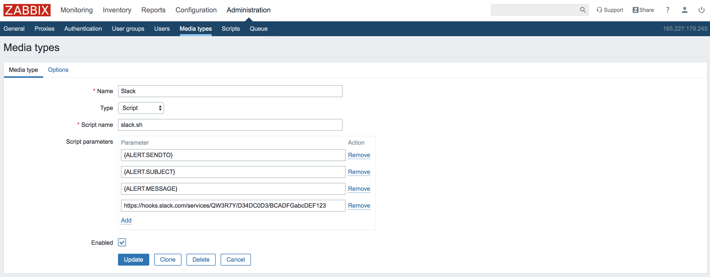

Zeromon Slack Setup
-------------------

In the Zabbix web interface, visit "Administration" > "Media Types".

This is reachable at `http://your.zabbix.ip.address/zabbix.php?action=mediatype.list`

Select the "Slack" media type to edit it.

This is also reachable at `http://your.zabbix.ip.address/zabbix.php?action=mediatype.edit&mediatypeid=4`

You will want to replace the `https://` example value with your Slack.com incoming webhook URL from [https://my.slack.com/services/new/incoming-webhook](https://my.slack.com/services/new/incoming-webhook) before checking the "Enabled" box and clicking "Update" to save your settings.

---

Additionally, you will need to modify your user profile to specify which Slack user name or channel should receive alerts by visiting `http://your.zabbix.ip.address/profile.php` and clicking the "Media" tab.

On the "Media" tab of your profile page, you will want to click "Edit" next to the Slack media.
Here you can change "Send to" to any existing/valid `@username` or `#channel` value within the Slack.com organization where you created the incoming webhook.
You will need to check the "Enabled" box and click "Update" within the pop-up.

Finally, you also need to click "Update" on the profile page itself to save your changes.

* originally from [https://imgur.com/a/ypXtX9B](https://imgur.com/a/ypXtX9B) *
